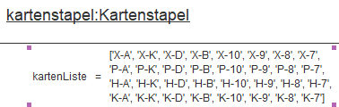

# Objektorientiertes programmieren:
## Objekt, Attribut, Methoden
Ein Objekt ist eine autonome Software-Einheit, die für bestimmte Aufgaben zuständig ist. Ein Objekt kann Daten mit Hilfe von Attributen verwalten und Operationen zur Verarbeitung der verwalteten Daten mit Hilfe von Methoden ausführen.

## Attribute:
Attribute sind and Objekte gebundene Variablen zur Verwaltung von Daten. Diese entsprechen in der Regel den Eigenschaften der betreffenden Objekte.

## Methoden:
Methoden sind  and Objekte gebundene Prozeduren oder Funktionen zur Verarbeitung von Daten.
Diese Methoden werden ausgeführt, wenn das betreffende Objekt veranlasst wird, einen bestimmte 
Operation auszuführen. 

## Objektzustand:
Eine Objekt befindet sich in einem bestimmten Zustand. Der aktuelle Objektzustand wird durch die aktuellem Werte der Attribute festgelegt - der Zustand indem sich das Objekt befindet.  

Den Zustand eines Objektes verdeutlicht man oft inn einem Objektdiagramm:

## Zugang auf Attribute und Methoden:
Attribute: `objekt.attribut`  
Methoden: `objekt.methode()`

